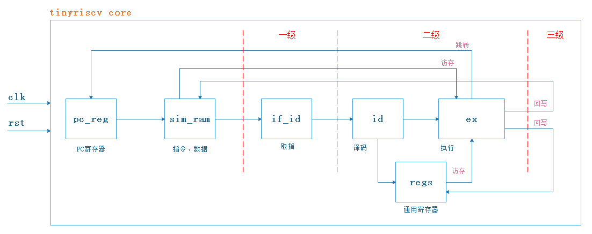
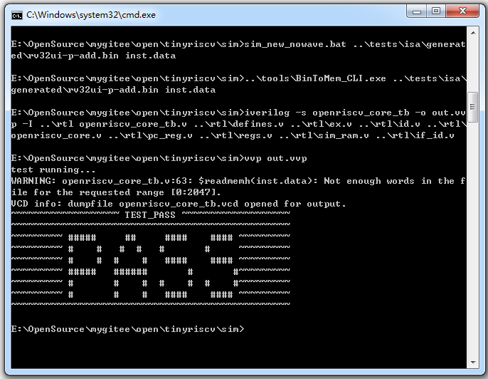

# 1.初衷

本开源项目的初衷是本人想入门RISC-V，熟悉RISC-V的指令内容和汇编语法。

本人对RISC-V很感兴趣，很看好RISC-V的发展前景，觉得RISC-V就是CPU界中的Linux。由于RISC-V是这两年才开始迅速发展的，因此关于RISC-V的学习参考资料目前还很少，特别是适合入门的资料，因此学习起来进度很缓慢，于是萌生了自己从零开始写RISC-V处理器核的想法。

本人是一名FPGA小白，为了快速入门、深入掌握RISC-V，我开始了学习FPGA和verilog的&quot;艰难&quot;历程。我工作的内容是和嵌入式软件相关的，平时根本不会接触到FPGA，也不会用到RISC-V，因此只能用业余时间来学习RISC-V，在经过断断续续学习FPGA和verilog一个多月后，总算有点成果了，也即本项目。

网上有不少关于RISC-V的开源项目，但是大多都写得很&quot;高深&quot;，对于我这种小白来说学习起来是非常吃力的，不太适合入门。本项目目前的代码量非常少，是很简单易懂的，对于想入门RISC-V的同学来说是一个很好的参考，希望能吸引更多的同学能够参与到RISC-V的学习中来，促进RISC-V的发展，如果能起到抛砖引玉的作用的话那就更好了，也许说是砖的话或者有点夸大了，但哪怕是起到一颗沙子的作用，也就足矣了。

# 2.介绍

本项目实现的是一个微RISC-V处理器核(tinyriscv)，用verilog语言编写，只求以最简单、最通俗易懂的方式实现RISC-V指令的功能，因此没有特意去对代码做任何的优化，因此你会看到里面写的代码有很多冗余的地方。tinyriscv处理器核有以下特点：

1. 实现了RV32I指令集，通过riscv的RV32I指令兼容性测试，支持以下指令：add addi and andi auipc beq bge bgeu blt bltu bne fence\_i jal jalr lb lbu lh lhu lw lui or ori sb sh sw sll slli slt slti sltiu sltu sra srai srl srli sub xor xori；
2. 支持RV32M指令集：mul mulh mulhu mulhsu div divu rem remu；
3. 采用三级流水线，即取指，译码、访存、执行，回写；
4. 可以运行简单的c语言程序；

项目中的各目录说明：

**rtl**：该目录包含tinyriscv核的所有verilog源码；

**sim**：该目录包含仿真的顶层testbench代码和批处理bat文件；

**tests**：该目录包含测试程序源码，其中example目录为c语言程序例程源码，isa目录为RV32I指令测试源码；

**tools**：该目录包含编译汇编和c语言程序所需GNU工具链和将二进制文件转成仿真所需的mem格式文件的工具BinToMem。BinToMem\_CLI.exe需要在cmd窗口下执行，BinToMem\_GUI.exe提供图形界面，双击即可运行；

**pic**：存放图片；

tinyriscv的整体框架如下：



# 3.如何使用

本项目运行在windows平台，编译仿真工具使用的是iverilog和vpp，波形查看工具使用的是gtkwave。

在使用之前需要安装以下工具：

1. 安装iverilog工具

可以在这里[http://bleyer.org/icarus/](http://bleyer.org/icarus/)下载，安装过程中记得同意把iverilog添加到环境变量中，当然也可以在安装完成后手动进行添加。安装完成后iverilog、vvp和gtkwave等工具也就安装好了。

2. 安装GNU工具链

可以在通过百度云下载(链接: https://pan.baidu.com/s/1bYgslKxHMjtiZtIPsB2caQ 提取码: 9n3c)，下载完成后将压缩包解压到本项目的tools目录下。

3. 安装make工具

可以通过百度云下载(链接: https://pan.baidu.com/s/1nFaUIwv171PDXuF7TziDFg 提取码: 9ntc)，下载完成后直接解压，然后将make所在的路径添加到环境变量里。

下面以add指令为例，说明如何使用本项目。

打开cmd窗口，进入到sim目录，执行以下命令：

```sim_new_nowave.bat ..\tests\isa\generated\rv32ui-p-add.bin inst.data```

如果运行成功的话就可以看到&quot;PASS&quot;的打印。其他指令使用方法类似。



# 4.未来计划

1. 在真实的FPGA平台(xilinx artix-7)上跑起来；
2. ......

# 5.更新记录

2020-01-02：支持RV32M的乘法指令。

2020-01-13：支持RV32M的除法指令。